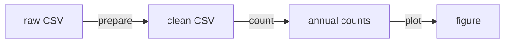
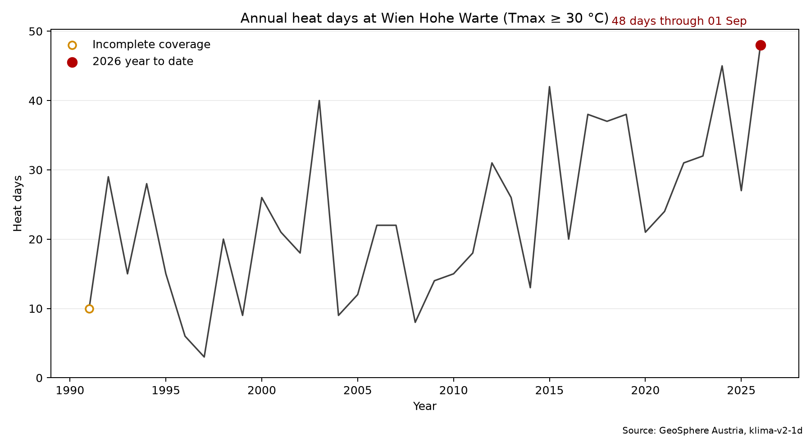
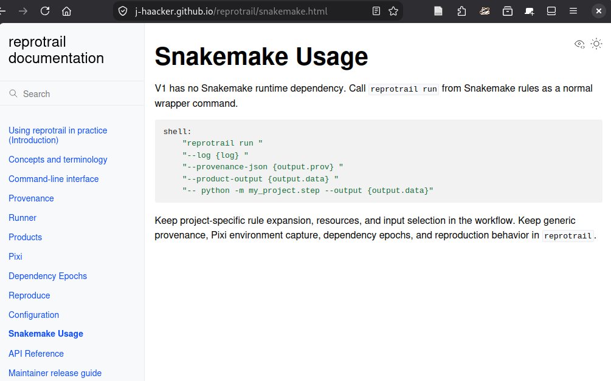

<style>
/* section {
  font-size: 30px;
  --part-start: 0;
  --part-length: 1;
} */

table {
  font-size: 0.7em;
}

/* pre {
  font-size: 0.72em;
} */

/* section.commands pre {
  font-size: 0.58em;
} */

section.diagram svg[data-marp-mermaid] {
  display: block;
  width: 100%;
  max-height: 320px;
  margin: 0.5em auto;
}

/* section.diagram svg[data-marp-mermaid] text {
  font-size: 19px !important;
} */

section.input {
  /* Slides 2–12 form the input and live-demo part. */
  --part-start: 2;
  --part-length: 10;
}

section.exercise {
  --part-start: 12;
  --part-length: 2;
}

section.wrapup {
  --part-start: 14;
  --part-length: 4;
}

section::before {
  content: "";
  position: absolute;
  bottom: 0;
  left: 0;
  height: 0.5em;
  width: calc(
    100% *
      (attr(data-marpit-pagination type(<number>)) - var(--part-start)) /
      var(--part-length)
  );
  background: var(--h1-color);
}

section.no-progress::before,
section.no-progress::after,
section.no-progress footer,
section.wrapup footer {
  display: none;
}
</style>

<!-- _class: lead no-progress invert -->

# Snakemake workshop

## A small workflow for Vienna heat days

<!--
Framing:
  - 
-->

---

<!-- _class: no-progress invert -->

# Today in 90 minutes

| Part | Time | Outcome |
|---|---:|---|
| Input and demo | 25 min | Read a rule, request a file, inspect the DAG |
| Independent work | 45 min | Build, observe, and generalize a workflow |
| Wrap-up | 20 min | Explain reruns and identify useful next steps |

By the end, you can turn a short script chain into a workflow you can request,
inspect, and extend.

<!--
- 
-->

---

<!-- _class: input commands -->

# Working scripts are only the beginning

```bash
bash scripts/download_data.sh
for nc in raw/*.nc; do
  ncap2 -O -s 'tas=tas+273.15' "$nc" "intermediate/${nc##*/}"
done
python scripts/analyze_data.py
python scripts/plot_data.py
```

The commands may be correct. The analysis structure still lives partly in
memory, notes, shell history, and directory conventions.

<!--
- Snakemake does not directly improve results
- but it helps
  - rerun the workflow (partly) after fixing bugs
  - ensure consistency
  - increasing reproducibility
- ask where this example records
  - dependencies
  - repeated jobs
  - final products
  - rerun decisions
-->

---

<!-- _class: input -->

<style scoped>
  ul {
    font-size: 14pt;
  }
</style>

# What a workflow makes explicit

| Manual execution leaves me asking… | A declared workflow records… |
|---|---|
| Which command produced this file? | matching inputs and outputs |
| What is stale after a change? | affected jobs in the DAG<sup>&ast;</sup> |
| Which work can run independently? | independent branches |
| What counts as complete? | concrete targets |

The shift is from writing down execution order to declaring how results are
produced.

<ul>

<sup>&ast;</sup> DAG = **D**irected **A**cyclic **G**raph

</ul>

---

<!-- _class: input -->

# Our small case: a file contract

```python
rule prepare_temperature_data:
    input:
        raw="data/raw/vienna_hohe_warte_tlmax.csv"
    output:
        clean="data/processed/vienna_hohe_warte_tlmax.csv"
    shell:
        "python scripts/prepare_data.py "
        "--input {input.raw} --output {output.clean}"
```

The paths declare what is required and produced. The command fulfills that
contract.

<!--
order: requested output, required input, then action.

(mention different definition order only conventional)
-->

---

<!-- _class: input -->

# Ask for a concrete file

```bash
snakemake -n -p data/processed/vienna_hohe_warte_tlmax.csv
```

- The final argument is the target file.
- `-n` describes the planned work without executing it.
- `-p` prints the rendered shell command.
- `{input.raw}` and `{output.clean}` become the named paths from the rule.

The target determines which part of the workflow is relevant.

<!--
(next slide continues to show backward working)
-->

---

<!-- _class: input diagram -->

# File contracts form the DAG



For a requested file, Snakemake works backwards: find a matching output,
collect its inputs, and continue until every input exists or can be produced.

---

<!-- _class: input -->

# A target rule defines “complete”

```python
rule all:
    input:
        "figures/heat_days_ge_30.png"
    default_target: True
```

Now this is enough:

```bash
snakemake -n -p
```

`all` is a convention. `default_target: True` explicitly selects the rule
used when no target is given.

<!--
- ??if no output, a rule can act as target collection
- explicit default selection avoids relying on rule order

??! guide into next slide: "30" replaced by token
-->

---

<!-- _class: input -->

# A rule is a pattern; a job is concrete

```python
output:
    counts="results/heat_days_ge_{threshold}.csv"
```

Requested file:

```text
results/heat_days_ge_30.csv  →  threshold = 30
```

One wildcard rule can create many concrete jobs without copying the rule.

---

<!-- _class: input -->

# `expand()` constructs concrete targets

```python
THRESHOLDS = [25, 30, 35]

rule all:
    input:
        expand(
            "figures/heat_days_ge_{threshold}.png",
            threshold=THRESHOLDS,
        )
    default_target: True
```

The producing rules contain wildcard patterns. `expand()` returns the three
specific filenames that define the complete result.

<!--
contrast:
- the wildcard belongs to reusable producing rules
- expand resolves the desired target collection immediately.
-->

---

<!-- _class: input -->



# Request, inspect, run

```bash
snakemake -s solutions/Snakefile -n -p \
  figures/heat_days_ge_30.png
```
```bash
snakemake -s solutions/Snakefile -j 1 \
  figures/heat_days_ge_30.png
```
```bash
snakemake -s solutions/Snakefile -j 1 \
  figures/heat_days_ge_30.png
```

<!--
five-minute demo
- reading job reasons and rendered commands

solicit no-op prediction

transition: no-op first case in upcoming table
-->

---

<!-- _class: input -->

# Reruns follow the requested result

| Workflow state | Expected work |
|---|---|
| All files current | Nothing to do |
| Figure missing | Plot only |
| Count and figure missing | Count, then plot |
| All generated files missing | Prepare, count, then plot |

A dry-run makes these decisions inspectable before execution.

<!--
Repeat main concept:
depending on change, workflow is partly rerun
-->

---

<!-- _class: lead invert no-progress -->

# Independent work — 45 minutes

1. Build the concrete 30 °C count-and-plot chain.
2. Observe its no-op and partial-rebuild behaviour.
3. Generalize it to 25, 30, and 35 °C.

Use the handout `exercises/workshop.md`. The complete solution is a
recovery path if the hints do not unblock you.

<!--
- 30 °C figure is the first finish line
- switch to next slide to show debugging help
-->

---

<!-- _class: invert no-progress -->

# Debug from the target backwards

When Snakemake surprises you, ask:

1. What reason does the dry-run give?
2. What exact file did I request?
3. Which rule output can produce it?
4. Which input files does that rule require?

Start with paths and targets before inspecting the Python scripts.

When asked by Snakemake, add `--unlock` or `--rerun-incomplete` flags.

---

<!-- _class: lead wrapup -->

# Wrap-up — share your experience and needs

- What helped you getting started?
- With what did you struggle?
- What support would you likely need for Snakemake-adoption?
- Which additional functionality would you need?

---

<!-- _class: wrapup -->

# Recap — The compact mental model

```text
declare file contracts → request a result → inspect the DAG → execute
  → repeat safely
```

Snakemake infers execution order from matching input and output files. Start
with one useful target; generalize only when repeated outputs reveal a pattern.

---

<!-- _class: wrapup -->

# Extend when a concrete need appears

| When… | Extend the workflow with… |
|---|---|
| Analysis values change | [Configuration](https://snakemake.readthedocs.io/en/stable/snakefiles/configuration.html) |
| Software must travel | [Per-rule environments](https://snakemake.readthedocs.io/en/stable/snakefiles/deployment.html) |
| Compute grows | Resources and an [execution profile](https://snakemake.readthedocs.io/en/stable/executing/cli.html#profiles) |

These extend the same rule contracts; they do not require redesigning the
workflow first.

---

<!-- _class: wrapup -->



# A personal outlook: Reprotrail

Snakemake supplies an executable workflow. For this result, I am experimenting with preserving:

- the data snapshot and code revision;
- the resolved environment;
- the Snakemake run and resulting file.

---

<!-- _class: lead invert no-progress -->

# Snakemake lets you repeat workflows effortlessly

Start simple, grow your workflows on demand.
